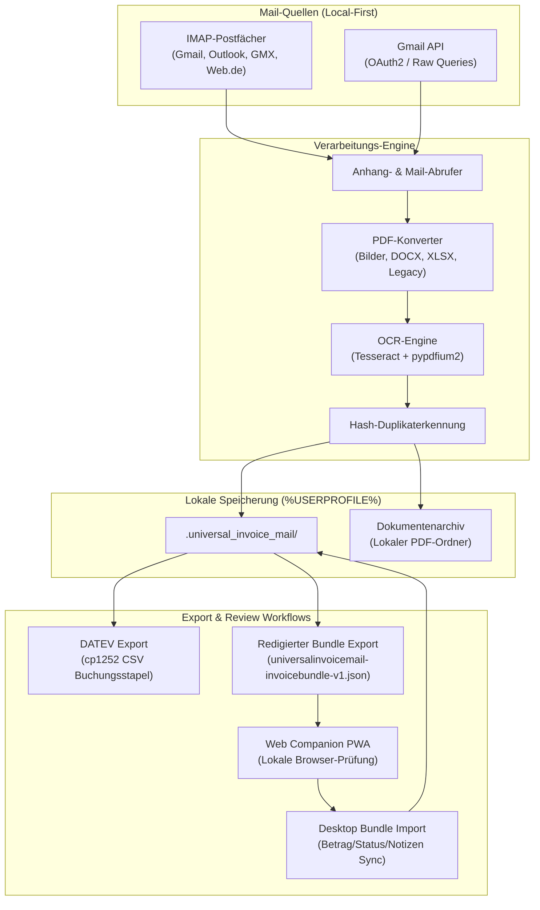

# UniversalInvoiceMail

[](https://github.com/doc-bricks)
[](https://github.com/open-bricks)
[](https://github.com/doc-bricks/UniversalInvoiceMail)
[](web_companion/)
[](https://www.python.org/)
[](#15-datenschutz--datensicherheit)
[](SECURITY.md)
[](SECURITY.md)
[](https://astral.sh/ruff)
[](THIRD_PARTY_LICENSES.md)
[](NOTICE)
[](llms.txt)
[](MARKETING-LOG.txt)
[](LICENSE)

Local-first Windows-Desktop-Tool zum Abrufen, Konvertieren und Archivieren von Rechnungen und Belegen aus E-Mails, inklusive privatem Rechnungsarchiv und DATEV-nahem CSV-Export.

**[English](README.md)** | **[Deutsch](README-DE.md)**

> [!NOTE]
> **KI / LLM-Integration:** Maschinenlesbarer Index und Architekturkontext sind unter [llms.txt](llms.txt) verfügbar.

---

### 🧭 Schnellnavigation

- [1. Überblick & Warum dieses Tool existiert](#1-ueberblick--warum-dieses-tool-existiert)
- [2. Kernfähigkeiten & Architektur](#2-kernfaehigkeiten--architektur)
- [3. Visuelle Systemarchitektur & Ablaufdiagramm](#3-visuelle-systemarchitektur--ablaufdiagramm)
- [4. Zielgruppen & Auffindbarkeit](#4-zielgruppen--auffindbarkeit)
- [5. Vergleichsmatrix gegenüber Alternativen](#5-vergleichsmatrix-gegenueber-alternativen)
- [6. Governance & Laufzeit-Invarianten](#6-governance--laufzeit-invarianten)
- [7. Mail-Quellen & Anhangs-Verarbeitung](#7-mail-quellen--anhangs-verarbeitung)
- [8. Buchhaltungs-Export & DATEV-Integration](#8-buchhaltungs-export--datev-integration)
- [9. Redigiertes Prüfbündel & Web-Companion](#9-redigiertes-pruefbuendel--web-companion)
- [10. Schnellstart & Ausführung](#10-schnellstart--ausfuehrung)
- [11. Lokale Datenhaltung & Profilverwaltung](#11-lokale-datenhaltung--profilverwaltung)
- [12. Optionale Abhängigkeiten & Fehlertoleranz](#12-optionale-abhaengigkeiten--fehlertoleranz)
- [13. Ökosystem & Geschwisterwerkzeuge](#13-oekosystem--geschwisterwerkzeuge)
- [14. Drittanbieter-Lizenzen & Level 1 SBOM](#14-drittanbieter-lizenzen--level-1-sbom)
- [15. Datenschutz & Datensicherheit](#15-datenschutz--datensicherheit)
- [16. Sicherheitsrichtlinie, Kontakte & 48h SLA](#16-sicherheitsrichtlinie-kontakte--48h-sla)
- [17. Verifikation & Testsuite](#17-verifikation--testsuite)
- [18. Roadmap, Änderungsprotokoll & Gesetzlicher Haftungsausschluss (§ 521 BGB)](#18-roadmap-aenderungsprotokoll--gesetzlicher-haftungsausschluss--521-bgb)

---

<a id="sec-01"></a><a id="1-overview--why-this-exists"></a><a id="overview--why-this-exists"></a><a id="1-ueberblick--warum-dieses-tool-existiert"></a><a id="ueberblick--warum-dieses-tool-existiert"></a>
## 1. Überblick & Warum dieses Tool existiert

Selbstständige, Freiberufler und Buchhaltungsverantwortliche stehen jeden Monat vor derselben mühsamen Aufgabe: Rechnungen aus verschiedensten E-Mail-Postfächern zusammensuchen, unzählige Dateiformate öffnen, PDFs manuell abspeichern und Buchungsdaten für Steuerberater oder DATEV aufbereiten.

Kommerzielle Cloud-Dienste verlangen dafür permanente Zugriffsrechte auf private Mailkonten, speichern sensible Finanzdaten auf externen Cloud-Servern und binden Anwender an teure Monatsabonnements.

**UniversalInvoiceMail** löst dieses Problem kompromisslos **100% Local-First**:
- **Keine Cloud-Abhängigkeit**: Läuft vollständig lokal auf Ihrem Windows-PC. E-Mails, Zugangsdaten, PDF-Anhänge und CSV-Dateien verbleiben ausschließlich in Ihrem lokalen Benutzerprofil.
- **Direkter Postfach-Abruf**: Verbindet sich via Standard-IMAP oder über die offizielle Google Gmail API mit minimalen Rechten.
- **Automatische Standardisierung**: Konvertiert Rechnungsanhänge (Bilder, DOCX, XLSX, Office-Formate) direkt in einheitliche, archivfähige PDFs mit optionaler OCR.
- **Standardisierter Buchhaltungs-Export**: Prüft Kontierungsdaten vorab und erzeugt standardkonforme DATEV-`cp1252`-EXTF-CSV-Buchungsstapel für den direkten Import in DATEV Unternehmen online oder Steuerberater-Software.


---

<a id="sec-02"></a><a id="2-key-capabilities--architecture"></a><a id="key-capabilities--architecture"></a><a id="2-kernfaehigkeiten--architektur"></a><a id="kernfaehigkeiten--architektur"></a>
## 2. Kernfähigkeiten & Architektur

| Fähigkeit | Technische Umsetzung | Konkreter Nutzen |
|---|---|---|
| **Multi-Provider Postfach-Zugriff** | IMAP4_SSL (Port 993) & Google Gmail API (OAuth2) | Kompatibel mit Gmail, Outlook, GMX, Web.de, T-Online und eigenen Mailservern. |
| **Profil- & Query-Filterung** | Eigene Suchprofile, Datumsfilter, Absendermuster und Gmail-Raw-Queries (`X-GM-RAW`) | Gezieltes Auffinden von Rechnungen bestimmter Shops, Dienstleister oder Zeiträume. |
| **Universelle PDF-Pipeline** | Integrierte Konverter für PNG, JPG, BMP, TIFF, WebP, DOCX und XLSX | Einheitliche, revisionssichere PDF-Belege für alle Rechnungsanhänge. |
| **Optionales OCR-Indexing** | Lokales Tesseract OCR + `pypdfium2`-Integration | Erzeugt durchsuchbare Textebenen für reine Bild-PDFs und Scans komplett offline. |
| **DATEV-Buchungsstapel-Export** | Vorab validierter `datev_exporter.py` für normierte `cp1252`-EXTF-CSVs | Reibungslose Übergabe an den Steuerberater mit SKR03/SKR04-Kontenmapping. |
| **Redigiertes Prüfbündel** | Schlanker Austauschstandard `universalinvoicemail-invoicebundle-v1.json` | Belegprüfung und Betragsfreigabe in einer leichtgewichtigen, offlinefähigen Browser-PWA. |
| **Hash-Duplikaterkennung** | SHA-256-Fingerprinting über alle lokalen Zielordner | Verhindert doppelte Buchungen oder erneutes Herunterladen bereits archivierter Belege. |
| **DPAPI-Geheimnisisolation** | Windows Credential Manager via Betriebssystem-`keyring` | Keine Passwörter oder Tokens im Klartext im Dateisystem oder Repository. |

---

<a id="sec-03"></a><a id="3-visual-architecture--flowchart"></a><a id="visual-architecture--flowchart"></a><a id="3-visuelle-systemarchitektur--ablaufdiagramm"></a><a id="visuelle-systemarchitektur--ablaufdiagramm"></a>
## 3. Visuelle Systemarchitektur & Ablaufdiagramm



---

<a id="sec-04"></a><a id="4-target-personas--discoverability"></a><a id="target-personas--discoverability"></a><a id="4-zielgruppen--auffindbarkeit"></a><a id="zielgruppen--auffindbarkeit"></a>
## 4. Zielgruppen & Auffindbarkeit

UniversalInvoiceMail richtet sich an vier zentrale Anwendergruppen:

| Zielgruppen-Kürzel | Anwenderprofil | Typische Herausforderungen | Wie UniversalInvoiceMail das löst |
|---|---|---|---|
| **[PERSONA-01]** | **Selbstständige & Kleinunternehmer** | Monatliches manuelles Durchforsten überfüllter Postfächer nach PDF-Rechnungen, Quittungen und Abobestätigungen. | Automatisierter profilbasierter Abruf (IMAP/Gmail), automatische Konvertierung in Standard-PDFs, privates Archiv und DATEV-Export. |
| **[PERSONA-02]** | **Steuerberater & Buchhalter** | Uneinheitliche Belegformate, fehlende Belegnummern und fehlerhafte Datums-/Dezimalformate, die den Import in DATEV scheitern lassen. | Integrierter DATEV-`cp1252`-EXTF-CSV-Export nach Buchungsstapel-Standard mit Vorab-Kontenvalidierung (4–8 Stellen) und robustem Betragsparser. |
| **[PERSONA-03]** | **Datenschutzbeauftragte & DSGVO-Verantwortliche** | Cloud-Rechnungssammler verlangen Vollzugriff auf Mailboxen und speichern vertrauliche Finanzunterlagen auf Fremdservern. | 100% Local-First-Betrieb (`INV-LOCAL-01`). Zugangsdaten verbleiben verschlüsselt im Windows Credential Manager (DPAPI), Dokumente auf der SSD. |
| **[PERSONA-04]** | **Desktop- & Python-Entwickler** | Fragile GUI-Wrapper mit enger Kopplung, blockierenden Dialogen und unzureichenden Testsuiten. | Saubere PySide6-Architektur, entkoppelte headless CSV-Exportroutinen, 212+ automatisierte Tests und transparente MIT-Lizenzierung. |

### Relevante Suchanfragen

- `lokales Rechnungsarchiv aus E-Mails`
- `Gmail Rechnungen herunterladen`
- `IMAP Belege extrahieren`
- `DATEV CSV Export aus E-Mails`
- `PySide6 Rechnungsmanager`
- `OCR Rechnungsanhänge archivieren`
- `privacy-first Buchhaltungsworkflow`
- `DATEV Buchungsstapel aus E-Mail`
- `Rechnungen aus Gmail archivieren`
- `DSGVO konforme Rechnungsablage Windows`

---

<a id="sec-05"></a><a id="5-comparative-matrix-vs-alternatives"></a><a id="comparative-matrix-vs-alternatives"></a><a id="5-vergleichsmatrix-gegenueber-alternativen"></a><a id="vergleichsmatrix-gegenueber-alternativen"></a>
## 5. Vergleichsmatrix gegenüber Alternativen

| Invarianten-Dimension | UniversalInvoiceMail | Cloud-SaaS-Aggregatoren | Manuelle Ordnerablage | Thunderbird Add-ins | Generische CLI-Skripte |
|---|---|---|---|---|---|
| **1. Local-First Datenschutz** | **JA (100% lokal auf SSD)** | NEIN (Fremdserver/Cloud) | JA | JA | JA |
| **2. DATEV EXTF Export** | **JA (Vorab validiert)** | Teilweise / Aufpreis | NEIN (Manuelle CSV) | NEIN | NEIN |
| **3. Anhang zu PDF** | **JA (Bilder/Docx/Xls)** | Teilweise | NEIN (Manuell) | Teilweise | NEIN |
| **4. Multi-Account IMAP** | **JA (SSL / Profile)** | JA (Gehostet) | NEIN (Mailprogramm) | JA | Fest verdrahtet |
| **5. Gmail API & Queries** | **JA (OAuth2 / Raw)** | JA | NEIN | Add-on nötig | Rohes Skript |
| **6. Geheimnisschutz** | **Windows DPAPI Keyring**| Cloud-Drittanbieter | Entfällt | Profilpasswort | Klartext-Konfig |
| **7. Offline-Fähigkeit** | **100% Offline-Archiv** | NEIN (Nur Online) | JA | JA | JA |
| **8. PWA Companion** | **JA (Lokal redigiert)** | Cloud Mobile App | NEIN | NEIN | NEIN |
| **9. Open Source / MIT** | **JA (Freie MIT-Lizenz)**| NEIN (Proprietär) | Entfällt | Variiert | Variiert |
| **10. Automatisierte Tests** | **212 Pytest + 10 Node**| Unbekannt / SaaS | 0 | Minimal | 0 – 5 |

---

<a id="sec-06"></a><a id="6-governance--runtime-invariants"></a><a id="governance--runtime-invariants"></a><a id="6-governance--laufzeit-invarianten"></a><a id="governance--laufzeit-invarianten"></a>
## 6. Governance & Laufzeit-Invarianten

Alle Programmmodule genügen 10 verbindlichen Architektur-Invarianten:

| Code | Invarianten-Bezeichnung | Geltungsbereich & Garantie |
|---|---|---|
| `INV-LOCAL-01` | **100% Local-First-Ausführung** | Alle Mailbox-Abrufe, PDF-Konvertierungen, OCR-Indizierungen und Archivordner bleiben strikt auf dem lokalen System; null Telemetrie oder Cloud-Tracking. |
| `INV-CRED-02` | **Verschlüsselter Geheimnisschutz** | Passwörter und Tokens werden über `keyring` sicher im Windows Credential Manager (DPAPI) verwaltet und niemals im Klartext gespeichert. |
| `INV-PRIVACY-03` | **Redigierte Bündel-Schnittstelle** | Exportierte Prüfbündel (`universalinvoicemail-invoicebundle-v1.json`) blenden E-Mail-Texte und Binärdateien standardmäßig aus, um Belegdaten im Browser zu schützen. |
| `INV-DATEV-04` | **Strikte DATEV-Validierung vor Speichern** | Der Einstellungsdialog erzwingt vor dem Sichern syntaktische Kontennummern-Prüfungen (4–8 Stellen), Eindeutigkeit der Schlüsselwörter und getrimmte Leerzeichen. |
| `INV-FLOOR-05` | **Gehärtete Sicherheitsuntergrenzen** | Abhängigkeiten definieren gepatchte Mindestversionen gegen bekannte Schwachstellen, insb. `Pillow>=12.3.0`, `keyring>=25.0.0` und `pytest>=9.1.1`. |
| `INV-TLS-06` | **Erzwungene TLS-Transportsicherheit** | Postfach-Abrufe erfordern zwingend TLS-Verschlüsselung (`IMAP4_SSL` auf Port 993, HTTPS für OAuth2); unverschlüsselte Klartextübertragungen werden verweigert. |
| `INV-LEASTPRIV-07` | **Minimale API-Berechtigungen** | Die Google-OAuth2-Anbindung fordert ausschließlich minimale Lese-/Suchrechte an; weitreichende administrative Kontorechte sind ausgeschlossen. |
| `INV-LAZYLOAD-08` | **Bedarfsweises Laden optionaler Module** | Google-Bibliotheken (`google-api-python-client` etc.) werden ausschließlich bei Bedarf geladen; IMAP-Nutzer bleiben frei von Google-Paketlast. |
| `INV-OFFLINE-09` | **Offline-Konvertierungs-Fallbacks** | Die gesamte Belegverarbeitung (PDF-Erzeugung, Bildzusammensetzung, DOCX/XLSX, OCR) arbeitet vollkommen offline ohne externe Webservices. |
| `INV-SLA-10` | **48h Sicherheits-SLA & 5-Tage-Triage** | Verbindliche Reaktionszeiten in `SECURITY.md` mit 48-Stunden-Erstbestätigung und 5-Werktage-Triage für verifizierte Sicherheitsmeldungen. |

---

<a id="sec-07"></a><a id="7-email-sources--attachment-processing"></a><a id="email-sources--attachment-processing"></a><a id="7-mail-quellen--anhangs-verarbeitung"></a><a id="mail-quellen--anhangs-verarbeitung"></a>
## 7. Mail-Quellen & Anhangs-Verarbeitung

- **Universelles IMAP**: Vollständige Unterstützung für SSL/TLS-gesicherte IMAP-Postfächer (Port 993) bei Gmail, Outlook/Hotmail, GMX, Web.de, T-Online sowie eigenen Servern.
- **Gmail-API-Integration**: Schneller, kontingentschonender Direktabruf mit nativer OAuth2-Authentifizierung und automatischer Token-Erneuerung.
- **Suchprofil-Konfiguration**: Flexible Filter nach Absender, Betreff, Textinhalt, Zeitraum und nativer Gmail-Query-Syntax (`X-GM-RAW`).
- **Umfassende Anhangskonvertierung**:
  - Bildanhänge (`.png`, `.jpg`, `.jpeg`, `.bmp`, `.tif`, `.tiff`, `.webp`) werden direkt in standardisierte PDFs konvertiert.
  - Dokumentenformate (`.docx`, `.xlsx`) werden lokal und formatgetreu nach PDF gerendert.
  - Ältere Office-Dateien (`.doc`, `.xls`) nutzen lokale Word/Excel-COM-Schnittstellen oder ein installiertes LibreOffice (`soffice.exe`).
- **Offline-OCR-Verarbeitung**: Bildbasierte Scans und PDFs ohne Textebene erhalten automatisch eine durchsuchbare OCR-Textebene via Tesseract und `pypdfium2`.
- **Kryptografische Duplikaterkennung**: Jeder Beleg wird per SHA-256 gehasht, um doppelte Downloads und Mehrfachbuchungen im Archiv auszuschließen.

---

<a id="sec-08"></a><a id="8-accounting-export--datev-integration"></a><a id="accounting-export--datev-integration"></a><a id="8-buchhaltungs-export--datev-integration"></a><a id="buchhaltungs-export--datev-integration"></a>
## 8. Buchhaltungs-Export & DATEV-Integration

- Die Rechnungstabelle bietet eine editierbare Betragsspalte in EUR.
- `DATEV exportieren` erzeugt DATEV-Buchungsstapel für die selektierten Rechnungen.
- `berater_nr` und `mandant_nr` sind im Exportdialog einstellbar.
- Der DATEV-Einstellungsdialog unterstützt editierbare Absender-/Schlüsselwort-Mappings, Hinzufügen/Entfernen, Standard-Wiederherstellung und Speicherung über `DATEVConfig`.
- Der Dialog prüft vor dem Speichern Berater- und Mandantennummer, Sachkontenlänge, nicht leere numerische Konten-Zuordnungen sowie die von Groß-/Kleinschreibung unabhängige Eindeutigkeit der Absender-/Schlüsselwort-Schlüssel und nennt Fehler direkt. Die technische Prüfung ersetzt keine fachliche Kontierungsprüfung; der bestehende 93-Spalten-Exportvertrag bleibt unverändert.
- Rechnungen ohne eingetragenen Betrag werden bewusst übersprungen und danach ausgewiesen.
- `Bundle Export` schreibt ein redigiertes JSON-Bundle mit Profilfiltern, DATEV-Basisdaten, Rechnungs-Hashes und optionalen Dateireferenzen.
- `Bundle Import` akzeptiert aus einem Companion nur Betrag, Prüfflag und Notiz zurück und prüft vor dem Reimport ID und Datei-Hash.
- Der dependency-freie `web_companion/` öffnet dieses Bundle lokal im Browser und exportiert ein minimales Änderungsbundle für den Desktop-Importer.

---

<a id="sec-09"></a><a id="9-redacted-bundle-review--web-companion"></a><a id="redacted-bundle-review--web-companion"></a><a id="9-redigiertes-pruefbuendel--web-companion"></a><a id="redigiertes-pruefbuendel--web-companion"></a>
## 9. Redigiertes Prüfbündel & Web-Companion

Für Anwender, die Rechnungsbeträge außerhalb der Hauptanwendung oder auf einem zweiten lokalen Gerät prüfen und kontieren möchten:

- **Redigiertes Austauschformat**: `universalinvoicemail-invoicebundle-v1.json` spart Mailtexte und Binärdateien gezielt aus, um strengen Datenschutz zu wahren (`INV-PRIVACY-03`). Die Formatspezifikation ist in [EXPORTFORMAT.md](EXPORTFORMAT.md) detailliert.
- **Abhängigkeitsfreie statische PWA**: Befindet sich im Verzeichnis `web_companion/` und läuft vollständig im lokalen Browser ohne Node-Server oder externe Webanfragen.
- **Zwei-Wege-Änderungsbündel**: Beträge, Prüfstatus und Notizen können im Browser ergänzt, als minimales Delta exportiert und per kryptografischem Hash-Abgleich wieder in UniversalInvoiceMail eingespielt werden.

---

<a id="sec-10"></a><a id="10-quick-start--execution-guide"></a><a id="quick-start--execution-guide"></a><a id="10-schnellstart--ausfuehrung"></a><a id="schnellstart--ausfuehrung"></a>
## 10. Schnellstart & Ausführung

### Windows-Starter (Empfohlen)

1. `start.bat` per Doppelklick ausführen.
2. Mailkonto hinzufügen (IMAP-Zugangsdaten oder Gmail-OAuth).
3. Suchprofil anlegen oder Shop-Vorlage wählen.
4. Zeitraum und Zielordner festlegen.
5. Auf **Rechnungen abrufen** klicken.

### Manuelle Python-Ausführung

```bash
# Repository klonen
git clone https://github.com/doc-bricks/UniversalInvoiceMail.git
cd UniversalInvoiceMail

# Abhängigkeiten installieren
pip install -r requirements.txt

# Anwendung starten
python UniversalInvoiceMail.py
```

---

<a id="sec-11"></a><a id="11-local-storage--profile-management"></a><a id="local-storage--profile-management"></a><a id="11-lokale-datenhaltung--profilverwaltung"></a><a id="lokale-datenhaltung--profilverwaltung"></a>
## 11. Lokale Datenhaltung & Profilverwaltung

Konfigurationen und Metadaten-Caches werden sauber unter `%USERPROFILE%\.universal_invoice_mail\` abgelegt:

```text
%USERPROFILE%\.universal_invoice_mail\
├── config.json          # Suchprofile, Filtereinstellungen und Optionen
├── invoices.json        # Lokaler Index der abgerufenen Rechnungsbelege
├── credentials.json     # Sichere Markierungsdatei (Passwörter liegen im DPAPI-Keyring)
└── token.json           # Zwischengespeicherte Google-OAuth2-Tokens
```

Das Standard-Rechnungsarchiv wird unter `%USERPROFILE%\Documents\Rechnungen\` verwaltet.

---

<a id="sec-12"></a><a id="12-optional-dependencies--graceful-degradation"></a><a id="optional-dependencies--graceful-degradation"></a><a id="12-optionale-abhaengigkeiten--fehlertoleranz"></a><a id="optionale-abhaengigkeiten--fehlertoleranz"></a>
## 12. Optionale Abhängigkeiten & Fehlertoleranz

UniversalInvoiceMail bleibt auch dann betriebsbereit, wenn optionale Bibliotheken auf dem Zielsystem fehlen:

- **Gmail API**: `google-api-python-client`, `google-auth`, `google-auth-oauthlib`. Fehlen diese Pakete, bleibt der klassische IMAP-Zugriff uneingeschränkt nutzbar.
- **OCR-Pakete**: `pytesseract`, `pypdfium2`, `pypdf`, Tesseract-Binary. Ohne OCR werden Bild-PDFs ohne Textebene archiviert.
- **Office-Automatisierung**: `pywin32` oder LibreOffice mit `soffice.exe`. Fehlt eine Office-Umgebung, werden `.doc`- und `.xls`-Dateien sauber übersprungen und im Log vermerkt.
- **DATEV-Export**: Das integrierte `datev_exporter.py`-Modul basiert rein auf der Python-Standardbibliothek und erzeugt DATEV-CSVs ohne externe Pakete.

---

<a id="sec-13"></a><a id="13-sibling-ecosystem-matrix"></a><a id="sibling-ecosystem-matrix"></a><a id="13-oekosystem--geschwisterwerkzeuge"></a><a id="oekosystem--geschwisterwerkzeuge"></a>
## 13. Ökosystem & Geschwisterwerkzeuge

UniversalInvoiceMail ist Teil der [doc-bricks](https://github.com/doc-bricks) Produktivitätssuite unter dem Dach von [open-bricks](https://github.com/open-bricks):

| Werkzeug | Ökosystem | Funktion & Schwerpunkt |
|---|---|---|
| [MailProcessor](https://github.com/doc-bricks/MailProcessor) | `doc-bricks` | System-Tray-Launcher und Orchestrator für alle Universal Mail Tools |
| [UniversalMailCleaner](https://github.com/doc-bricks/UniversalMailCleaner) | `doc-bricks` | Regelbasierter IMAP- und Gmail-Cleaner mit Safe-Trash-Modus |
| [UniversalDocsGrabber](https://github.com/doc-bricks/UniversalDocsGrabber) | `doc-bricks` | Dokumente und Anhänge automatisiert aus IMAP-Postfächern laden |
| [DokuZen](https://github.com/doc-bricks/DokuZen) | `doc-bricks` | Minimalistischer Markdown-Dokumentenbetrachter und strukturierter Reader |
| [PDFtoPDFocr](https://github.com/doc-bricks/PDFtoPDFocr) | `doc-bricks` | Präzise OCR-Textebene für gescannte PDF-Dokumente |
| [DokuReader](https://github.com/doc-bricks/DokuReader) | `doc-bricks` | Offline-Dokumentenbetrachter und Indexer für strukturierte Archive |
| [MediaBrain](https://github.com/file-bricks/MediaBrain) | `file-bricks` | Lokale KI-gestützte Medien-Kategorisierung und Verschlagwortung |
| [TextBrain](https://github.com/file-bricks/TextBrain) | `file-bricks` | Semantische Textsuche und lokale Dokumenten-Extraktion |
| [ProFiler](https://github.com/file-bricks/ProFiler) | `file-bricks` | Erweiterte Datei-Organisation und regelbasierte Massen-Umbenennung |
| [DevCenter](https://github.com/dev-bricks/DevCenter) | `dev-bricks` | Entwickler-Cockpit und Repository-Telemetrie-Hub |
| [CodeBox](https://github.com/dev-bricks/CodeBox) | `dev-bricks` | Wiederverwendbare Code-Snippet-Ablage mit semantischer Suche |

---

<a id="sec-14"></a><a id="14-third-party-licenses--level-1-sbom"></a><a id="third-party-licenses--level-1-sbom"></a><a id="14-drittanbieter-lizenzen--level-1-sbom"></a><a id="drittanbieter-lizenzen--level-1-sbom"></a>
## 14. Drittanbieter-Lizenzen & Level 1 SBOM

- **Permissive MIT-Lizenz**: UniversalInvoiceMail steht unter der freien [MIT-Lizenz](LICENSE).
- **Kanonische Attribution**: Formeller Urheberrechtshinweis und Ökosystem-Governance sind in [NOTICE](NOTICE) verankert.
- **Level 1 SBOM**: Vollständiges Drittanbieter-Inventar, Sicherheitsuntergrenzen und Invarianten-Matrix sind in [THIRD_PARTY_LICENSES.md](THIRD_PARTY_LICENSES.md) auditiert.
- **Kein virales Copyleft**: Es kommen keine GPL-, AGPL- oder SSPL-Bibliotheken zum Einsatz. Die dynamische Bindung von `PySide6` unter LGPL-3.0 ist konform und belässt die Anwendung unter MIT.
- **Unprivilegierter Modus**: Entwickelt für `RunAsInvoker`-Betrieb ohne Administrator- oder Root-Rechte.

---

<a id="sec-15"></a><a id="15-privacy--data-protection-policy"></a><a id="privacy--data-protection-policy"></a><a id="15-datenschutz--datensicherheit"></a><a id="datenschutz--datensicherheit"></a>
## 15. Datenschutz & Datensicherheit

- Vollständige Datenschutzerklärung: [PRIVACY_POLICY.md](PRIVACY_POLICY.md).
- Technischer Support und Hilfe: [SUPPORT.md](SUPPORT.md).
- Zugangsdaten und OAuth-Tokens liegen ausschließlich unter `%USERPROFILE%\.universal_invoice_mail\`, niemals im Git-Repository.
- Die Konfiguration `.gitignore` sperrt `credentials.json`, `client_secret*.json`, `token.json`, lokale Datenbanken und OCR-Temporärdateien zuverlässig aus.
- Keine Telemetrie oder externe Übertragungen: Netzwerkverbindungen erfolgen ausschließlich zu den vom Anwender eingerichteten Postfachservern.

---

<a id="sec-16"></a><a id="16-security-policy-contacts--48h-sla"></a><a id="security-policy-contacts--48h-sla"></a><a id="16-sicherheitsrichtlinie-kontakte--48h-sla"></a><a id="sicherheitsrichtlinie-kontakte--48h-sla"></a>
## 16. Sicherheitsrichtlinie, Kontakte & 48h SLA

UniversalInvoiceMail unterliegt den verbindlichen Sicherheitsleitlinien von open-bricks:

- **Zweisprachige Sicherheitsrichtlinie**: Dokumentiert in [SECURITY.md](SECURITY.md).
- **Direkte Sicherheitskontakte**:
  - `security@doc-bricks.org`
  - `security@open-bricks.org`
  - `support@lukasgeiger.com`
- **Reaktions-SLAs**:
  - Verbindliche Eingangsbestätigung binnen **48 Stunden**.
  - Risikobewertung und Triage binnen **5 Werktagen**.
  - Priorisierte Bereitstellung von Sicherheits-Patches.

---

<a id="sec-17"></a><a id="17-verification--automated-test-suite"></a><a id="verification--automated-test-suite"></a><a id="17-verifikation--testsuite"></a><a id="verifikation--testsuite"></a>
## 17. Verifikation & Testsuite

```bash
# Vollständige Python-Vertrags- und Funktionstests ausführen
PYTHONIOENCODING=utf-8 python -m pytest -ra -q

# Headless UI-Smoketest ausführen
QT_QPA_PLATFORM=offscreen python tests/source_platform_smoke.py

# Web Companion PWA-Vertragstests ausführen
npm --prefix web_companion test

# Ruff-Linter ausführen
ruff check .

# Bytecode-Kompilierung validieren
python -m compileall -q .
```

Das Repository enthält gemockte Python-Tests für Hilfsfunktionen, IMAP-/Gmail-Workflows, DATEV-Abläufe, Bündel-Export/-Import, Barrierefreiheit, Metadaten-Parität sowie Node-Vertragstests für den Web Companion (212 Pytest + 10 Node-Tests 100% grün).

---

<a id="sec-18"></a><a id="18-roadmap-changelog--german-statutory-notice--521-bgb"></a><a id="roadmap-changelog--german-statutory-notice--521-bgb"></a><a id="18-roadmap-aenderungsprotokoll--gesetzlicher-haftungsausschluss--521-bgb"></a><a id="roadmap-aenderungsprotokoll--gesetzlicher-haftungsausschluss--521-bgb"></a>
## 18. Roadmap, Änderungsprotokoll & Gesetzlicher Haftungsausschluss (§ 521 BGB)

- [x] **v2.3.0 Release**: EML/MSG-Anhangsextraktion, selektionsabhängiger CSV-Export, DATEV-Betragsrobustheit und unprivilegierte Ausführung.
- [x] **Pfad A Technische Hygiene & CI-Härtung**: Stale-/Welcome-Workflows, Concurrency-Begrenzung, Level 1 SBOM-Audit, NOTICE-Attribution und Lock-Schutz.
- [x] **Pfad B Marketing, Discoverability & Navigation**: 18-Punkte bilaterale Schnellnavigation, duale reziproke Anker, 4 Zielgruppen, 5-Wege-Vergleichsmatrix, 20-Topic-Metadatensättigung und § 521 BGB Haftungsausschluss.
- [ ] **Windows Store Packaging Staging**: Automatisierte MSIX-Manifestbereitstellung und Vorbereitung für den Windows Store.

Vollständige Release-Details siehe [CHANGELOG.md](CHANGELOG.md), langfristige Planung in [ROADMAP.txt](ROADMAP.txt).

### Gesetzlicher Haftungsausschluss (§ 521 BGB Gefälligkeitsrecht)

Die Bereitstellung dieser Software und ihrer Dokumentation erfolgt unentgeltlich. Gemäß den gesetzlichen Haftungsregelungen des deutschen Bürgerlichen Gesetzbuchs für unentgeltliche Leistungen (**§ 521 BGB** — *Haftung des Schenkers*) ist die Haftung für Sach- und Rechtsmängel auf Vorsatz und grobe Fahrlässigkeit beschränkt. Jede weitergehende Haftung oder Gewährleistung für leichte Fahrlässigkeit ist im gesetzlich zulässigen Rahmen ausdrücklich ausgeschlossen.
