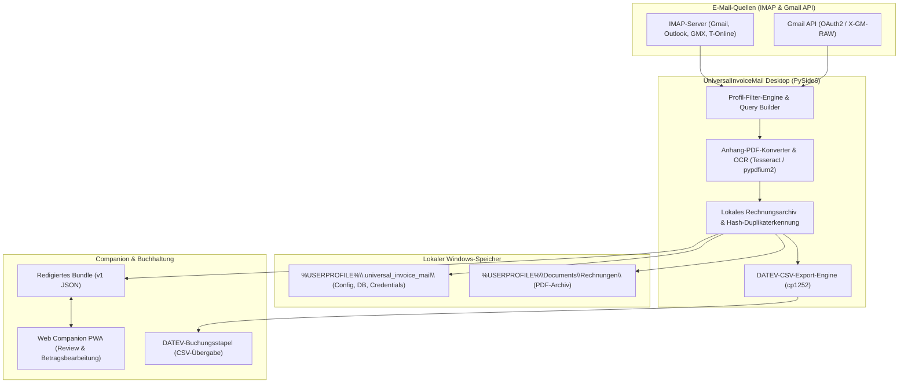

# UniversalInvoiceMail

[](https://github.com/doc-bricks/UniversalInvoiceMail/actions/workflows/tests.yml)
[](https://github.com/doc-bricks/UniversalInvoiceMail/actions)
[](web_companion)
[](LICENSE)
[](#datenschutz)
[](llms.txt)

Local-first Windows-Desktop-Tool zum Abrufen, Konvertieren und Archivieren von Rechnungen und Belegen aus E-Mails, inklusive privatem Rechnungsarchiv und DATEV-nahem CSV-Export.

**Sprachen:** [English](README.md) | [Deutsch](README-DE.md)

> [!NOTE]
> **KI-Agenten & LLM-Kontext:** Dieses Repository stellt strukturierte Metadaten in [`llms.txt`](llms.txt) bereit. Autonome KI-Agenten und LLMs können `llms.txt` abfragen, um Projektstruktur, Testbefehle, Sicherheitsgrenzen und lokale Datenpfade sicher zu analysieren, ohne Benutzereinstellungen oder Zugangsdaten zu verändern.


## Architektur & Datenfluss



## Einstieg

| Bedarf | Einstieg |
|--------|----------|
| Rechnungen aus Mailkonten sammeln | IMAP- oder Gmail-API-Konto in der App einrichten |
| Belege von Shops oder Dienstleistern finden | Profilfilter für Absender, Betreff, Body-Text, Zeitraum und Gmail-Raw-Queries |
| Lokales Rechnungsarchiv pflegen | Zielordner im Windows-Benutzerprofil oder in einem lokalen Sync-Ordner |
| Buchhaltungsübergabe vorbereiten | Editierbare EUR-Beträge und DATEV-naher `cp1252`-CSV-Export |
| Portables Datenformat verstehen | [EXPORTFORMAT.md](EXPORTFORMAT.md) für das implementierte redigierte Austausch-Bundle |

## Überblick

UniversalInvoiceMail verbindet klassische IMAP-Postfächer und optional die Gmail API mit einem lokalen PDF-Archiv-Workflow. Das Tool lädt Anhänge, rendert Bestellbestätigungen als PDF, erkennt Duplikate per Hash und speichert die Ergebnisse strukturiert pro Profil oder Shop.

## Funktionen

- Universal IMAP für Gmail, Outlook, GMX, Web.de, T-Online und weitere Provider
- Optionale Gmail-API-Anbindung für schnellere und robustere Gmail-Läufe
- Optionaler Gmail-Query-Builder pro Profil für Gmail API und Gmail-IMAP mit `X-GM-RAW`
- Profilbasierte Filter für Absender, Betreff, Body und Zeiträume
- Download von PDF-Anhängen sowie Konvertierung weiterer Anhangstypen nach PDF
- Unterstützte Konvertierung: Bilder (`.png`, `.jpg`, `.jpeg`, `.bmp`, `.tif`, `.tiff`, `.webp`), `.docx`, `.xlsx`
- Optionale Legacy-Konvertierung für `.doc` und `.xls` via Word/Excel-COM oder LibreOffice
- Optionales OCR für bildbasierte PDFs mit Tesseract und `pypdfium2`
- Editierbare Rechnungsbeträge direkt in der Tabelle für nachgelagerte Buchhaltung
- Optionaler DATEV-Export mit konfigurierbarer Berater-/Mandantennummer und Konten-Mapping im SKR03-Stil
- Redigierter Export/Reimport von `universalinvoicemail-invoicebundle-v1.json` für Companion- und Prüf-Workflows
- Hash-basierte Duplikat-Erkennung über lokale Archivordner
- Sichere Passwortspeicherung via `keyring`

## Schnellstart

### Windows

1. `start.bat` ausführen
2. Mailkonto anlegen
3. Profil oder Shop-Vorlage konfigurieren
4. Zeitraum und Zielordner festlegen
5. `Rechnungen abrufen` starten

### Manuell

```bash
pip install -r requirements.txt
python UniversalInvoiceMail.py
```

## Typischer Workflow

1. Konto für IMAP oder Gmail API anlegen
2. Suchprofil mit Filtern und Zielordner konfigurieren
3. Optional OCR und PDF-Modus einstellen
4. Scan auslösen
5. Für buchungsrelevante Einträge Rechnungsbeträge ergänzen
6. Ergebnisse im lokalen Rechnungsarchiv prüfen, als DATEV-CSV exportieren oder als redigiertes Bundle übergeben

## Lokale Daten

Konfigurations- und Laufzeitdaten werden unter `%USERPROFILE%\.universal_invoice_mail\` gespeichert:

```text
%USERPROFILE%\.universal_invoice_mail\
├── config.json
├── invoices.json
├── credentials.json
└── token.json
```

Standardmäßig landen archivierte Dateien unter `%USERPROFILE%\Documents\Rechnungen\`.

## Optionale Komponenten

- Gmail API: `google-api-python-client`, `google-auth`, `google-auth-oauthlib`
- OCR: `pytesseract`, `pypdfium2`, `pypdf`, Tesseract OCR
- Legacy Office: `pywin32` oder ein lokales LibreOffice mit `soffice.exe`
- DATEV-Export nutzt das mitgelieferte `datev_exporter.py` und schreibt `cp1252`-CSV-Dateien

Wenn kein OCR- oder Office-Backend verfügbar ist, bleibt der Lauf robust; nicht unterstützte Schritte werden protokolliert und übersprungen.

## Buchhaltungs-Export

- Die Rechnungstabelle enthält eine editierbare Spalte `Betrag (€)`.
- `DATEV exportieren` erzeugt einen DATEV-Buchungsstapel aus ausgewählten Rechnungen.
- `berater_nr` und `mandant_nr` bleiben im Exportdialog konfigurierbar.
- Rechnungen ohne eingetragenen Betrag werden bewusst übersprungen und danach ausgewiesen.
- `Bundle Export` schreibt ein redigiertes JSON-Bundle mit Profilfiltern, DATEV-Basisdaten, Rechnungs-Hashes und optionalen Dateireferenzen.
- `Bundle Import` akzeptiert aus einem Companion nur Betrag, Prüfflag und Notiz zurück und prüft vor dem Reimport ID und Datei-Hash.

## Suchkontext

UniversalInvoiceMail passt zu Suchanfragen wie `lokales Rechnungsarchiv aus E-Mails`, `Gmail Rechnungen herunterladen`, `IMAP Belege extrahieren`, `DATEV CSV Export aus E-Mails`, `PySide6 Rechnungsmanager`, `OCR Rechnungsanhänge archivieren` und `privacy-first Buchhaltungsworkflow`. Das Projekt ist keine gehostete Rechnungsplattform, keine Mail-Marketing-Automation und keine Cloud-Buchhaltung; Zugangsdaten, Tokens, Archive und erzeugte CSV-Dateien bleiben standardmäßig lokal im Windows-Profil.

## Tests

```bash
PYTHONIOENCODING=utf-8 python -m pytest -q
cd web_companion && npm test
```

Vorhanden sind aktuell 120 verifizierte grüne Tests (110 Pytest-Tests für Hilfsfunktionen, IMAP-/Gmail-Workflows, DATEV-nahe Abläufe, Bundle-Export/-Import und UI-Barrierefreiheit sowie 10 Node.js-Tests für den Web Companion PWA).

## Datenschutz

- Zugangsdaten und Gmail-OAuth-Tokens werden unter `%USERPROFILE%\.universal_invoice_mail\` gespeichert, nicht im Repository.
- `.gitignore` schließt `credentials.json`, `client_secret*.json`, `token.json`, lokale Datenbanken, Beispielausgaben und portable OCR-Bundles aus.
- Echte Rechnungen, Anhänge und erzeugte Release-Artefakte bleiben lokal.

## Verwandte Tools

Teil der [doc-bricks](https://github.com/doc-bricks) Mail-Suite:

| Tool | Beschreibung |
|------|--------------|
| [MailProcessor](https://github.com/doc-bricks/MailProcessor) | System-Tray-Launcher für alle Universal Mail Tools |
| [UniversalMailCleaner](https://github.com/doc-bricks/UniversalMailCleaner) | Regelbasierter IMAP-Cleaner mit Safe-Mode |
| [UniversalDocsGrabber](https://github.com/doc-bricks/UniversalDocsGrabber) | Dokumente und Anhänge aus IMAP-Mails herunterladen |

## Lizenz

[MIT](LICENSE)
