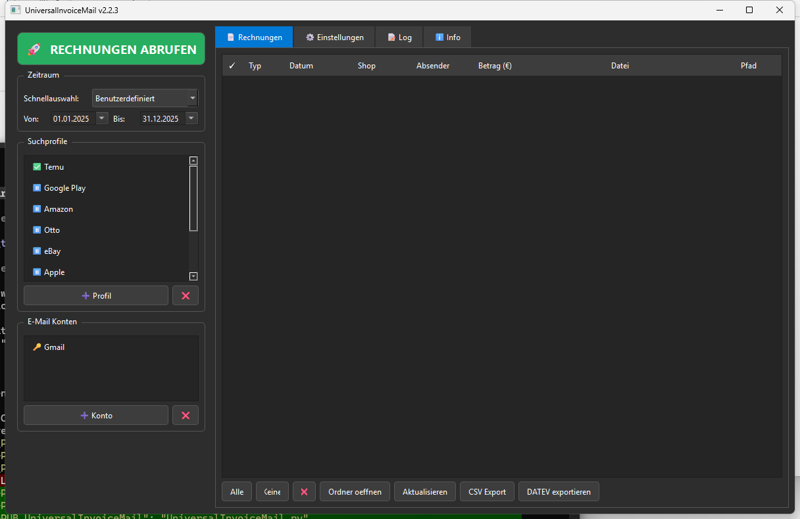

# UniversalInvoiceMail

[](https://github.com/doc-bricks/UniversalInvoiceMail/actions/workflows/tests.yml)

Local-first Windows desktop tool for collecting invoices and receipts from email accounts, converting attachments to PDF, keeping a private archive, and preparing DATEV-style CSV exports.

> **Deutsche Dokumentation:** [README-DE.md](README-DE.md)



## Start Here

| Need | Start with |
|------|------------|
| Collect invoices from mailboxes | IMAP or Gmail API account setup in the app |
| Find receipts from shops or providers | Profile filters for sender, subject, body text, dates, and Gmail raw queries |
| Keep a local invoice archive | Target folders under your Windows user profile or a local sync folder |
| Prepare accounting handoff | Editable EUR amounts and DATEV-style cp1252 CSV export |
| Understand portable data | [EXPORTFORMAT.md](EXPORTFORMAT.md) for the planned redacted exchange bundle |

## Features

- Universal IMAP for Gmail, Outlook, GMX, Web.de, T-Online, and other providers
- Optional Gmail API integration for faster and more robust Gmail runs
- Optional per-profile Gmail query builder for Gmail API and Gmail IMAP with `X-GM-RAW`
- Profile-based filters for sender, subject, body, and date ranges
- Downloads PDF attachments and converts other attachment types to PDF
- Supported conversions: images (`.png`, `.jpg`, `.jpeg`, `.bmp`, `.tif`, `.tiff`, `.webp`), `.docx`, `.xlsx`
- Optional legacy conversion for `.doc` and `.xls` via Word/Excel-COM or LibreOffice
- Optional OCR for image-based PDFs (Tesseract + `pypdfium2`)
- Manual invoice amount column plus DATEV export for selected invoices
- Hash-based duplicate detection across local archive folders
- Secure credential storage via `keyring`

## Quick Start

### Windows

1. Run `start.bat`
2. Add a mail account
3. Configure a profile or shop template
4. Set date range and target folder
5. Click "Fetch Invoices"

### Manual

```bash
pip install -r requirements.txt
python UniversalInvoiceMail.py
```

## Typical Workflow

1. Add an IMAP or Gmail API account
2. Configure a search profile with filters and target folder
3. Optionally enable OCR and PDF mode
4. Start a scan
5. Enter invoice amounts for entries that should flow into accounting
6. Review results in the local invoice archive or export them as DATEV CSV

## Local Data

Runtime data is stored in `%USERPROFILE%\.universal_invoice_mail\`:

```text
%USERPROFILE%\.universal_invoice_mail\
├── config.json
├── invoices.json
├── credentials.json
└── token.json
```

Archived files are written to `%USERPROFILE%\Documents\Rechnungen\` by default.

## Optional Components

- Gmail API: `google-api-python-client`, `google-auth`, `google-auth-oauthlib`
- OCR: `pytesseract`, `pypdfium2`, `pypdf`, Tesseract OCR
- Legacy Office: `pywin32` or a local LibreOffice with `soffice.exe`
- DATEV export uses the bundled `datev_exporter.py` and writes cp1252 CSV files

When no OCR or Office backend is available, unsupported steps are logged and skipped; the run remains robust.

## Accounting Export

- The invoice table exposes an editable amount column in EUR.
- `DATEV exportieren` creates DATEV booking batches from the selected invoices.
- `berater_nr` and `mandant_nr` are configurable in the export dialog.
- Invoices without an entered amount are skipped deliberately and called out after export.

## Search Context

UniversalInvoiceMail is intended for searches such as `local invoice email archive`, `Gmail invoice downloader`, `IMAP receipt extractor`, `DATEV CSV export from email`, `PySide6 invoice manager`, `OCR invoice attachment archive`, and `privacy-first accounting document workflow`. It is unrelated to hosted invoice platforms, mailbox marketing automation, or cloud bookkeeping suites; the default workflow keeps credentials, tokens, archives, and generated CSV files local to the Windows profile.

## Tests

```bash
PYTHONIOENCODING=utf-8 python -m pytest -q
QT_QPA_PLATFORM=offscreen python tests/source_platform_smoke.py
```

The repository currently has 101 mocked tests for helper functions, IMAP/Gmail workflows, DATEV-adjacent behavior and compact UI control accessibility.

For Linux, an additional headless smoke covers the desktop start path, missing-keyring handling, LibreOffice fallback detection and CSV export without requiring a visible session.

## Privacy

- Credentials and Gmail OAuth tokens are stored under `%USERPROFILE%\.universal_invoice_mail\`, not in the repository.
- `.gitignore` excludes `credentials.json`, `client_secret*.json`, `token.json`, local databases, sample output folders, and portable OCR bundles.
- Real invoices, attachments, and generated release artifacts should remain local.

## Related Tools

Part of the [doc-bricks](https://github.com/doc-bricks) mail suite:

| Tool | Description |
|------|-------------|
| [MailProcessor](https://github.com/doc-bricks/MailProcessor) | System tray launcher for all Universal Mail Tools |
| [UniversalMailCleaner](https://github.com/doc-bricks/UniversalMailCleaner) | Rule-based IMAP mailbox cleaner with safe mode |
| [UniversalDocsGrabber](https://github.com/doc-bricks/UniversalDocsGrabber) | Download documents and attachments from IMAP mail |

## License

[MIT](LICENSE)
