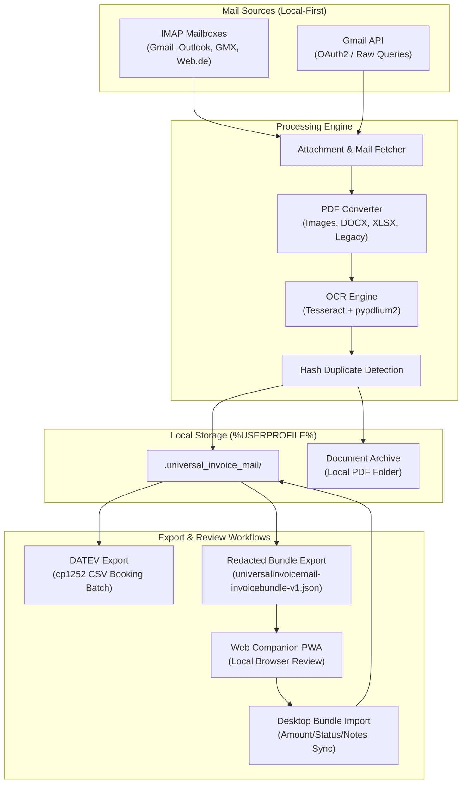

# UniversalInvoiceMail

[](https://github.com/doc-bricks)
[](https://github.com/open-bricks)
[](https://github.com/doc-bricks/UniversalInvoiceMail)
[](web_companion/)
[](https://www.python.org/)
[](#15-privacy--data-protection-policy)
[](SECURITY.md)
[](SECURITY.md)
[](https://astral.sh/ruff)
[](THIRD_PARTY_LICENSES.md)
[](NOTICE)
[](llms.txt)
[](MARKETING-LOG.txt)
[](LICENSE)

Local-first Windows desktop tool for collecting invoices and receipts from email accounts, converting attachments to PDF, keeping a private archive, and preparing DATEV-style CSV exports.

**[English](README.md)** | **[Deutsch](README-DE.md)**

> [!NOTE]
> **AI / LLM Discovery:** Machine-readable index and architecture context are available in [llms.txt](llms.txt).

---

### 🧭 Quick Navigation

- [1. Overview & Why This Exists](#1-overview--why-this-exists)
- [2. Key Capabilities & Architecture](#2-key-capabilities--architecture)
- [3. Visual Architecture & Flowchart](#3-visual-architecture--flowchart)
- [4. Target Personas & Discoverability](#4-target-personas--discoverability)
- [5. Comparative Matrix vs. Alternatives](#5-comparative-matrix-vs-alternatives)
- [6. Governance & Runtime Invariants](#6-governance--runtime-invariants)
- [7. Email Sources & Attachment Processing](#7-email-sources--attachment-processing)
- [8. Accounting Export & DATEV Integration](#8-accounting-export--datev-integration)
- [9. Redacted Bundle Review & Web Companion](#9-redacted-bundle-review--web-companion)
- [10. Quick Start & Execution Guide](#10-quick-start--execution-guide)
- [11. Local Storage & Profile Management](#11-local-storage--profile-management)
- [12. Optional Dependencies & Graceful Degradation](#12-optional-dependencies--graceful-degradation)
- [13. Sibling Ecosystem Matrix](#13-sibling-ecosystem-matrix)
- [14. Third-Party Licenses & Level 1 SBOM](#14-third-party-licenses--level-1-sbom)
- [15. Privacy & Data Protection Policy](#15-privacy--data-protection-policy)
- [16. Security Policy, Contacts & 48h SLA](#16-security-policy-contacts--48h-sla)
- [17. Verification & Automated Test Suite](#17-verification--automated-test-suite)
- [18. Roadmap, Changelog & German Statutory Notice (§ 521 BGB)](#18-roadmap-changelog--german-statutory-notice--521-bgb)

---

<a id="sec-01"></a><a id="1-overview--why-this-exists"></a><a id="overview--why-this-exists"></a><a id="1-ueberblick--warum-dieses-tool-existiert"></a><a id="ueberblick--warum-dieses-tool-existiert"></a>
## 1. Overview & Why This Exists

Small business owners, freelancers, and tax professionals face the repetitive monthly burden of hunting down invoices across multiple email inboxes, extracting varied attachment formats, and manually preparing records for accounting handoff.

Commercial cloud aggregators require granting third parties ongoing access to personal mailboxes, store sensitive financial records on external cloud servers, and enforce recurring subscriptions.

**UniversalInvoiceMail** was engineered to solve this problem with an uncompromising **100% Local-First** approach:
- **Zero Cloud Dependence**: Operates locally on your Windows desktop. All emails, credentials, PDF attachments, and generated CSV files remain strictly under your user profile.
- **Direct Mail Retrieval**: Connects directly to IMAP mailboxes or via the official Google Gmail API with least-privilege scopes.
- **Automated Standardization**: Automatically converts invoice attachments (images, DOCX, XLSX, legacy Office formats) into archival PDF format with optional OCR.
- **Standardized Accounting Output**: Pre-validates accounts and exports standardized DATEV `cp1252` EXTF CSV booking batches ready for import into DATEV Unternehmen online or tax advisor software.


---

<a id="sec-02"></a><a id="2-key-capabilities--architecture"></a><a id="key-capabilities--architecture"></a><a id="2-kernfaehigkeiten--architektur"></a><a id="kernfaehigkeiten--architektur"></a>
## 2. Key Capabilities & Architecture

| Capability | Technical Realization | Benefit |
|---|---|---|
| **Multi-Provider Mail Access** | IMAP4_SSL (port 993) & Google Gmail API (OAuth2) | Compatible with Gmail, Outlook, GMX, Web.de, T-Online, and private mail servers. |
| **Profile & Query Filtering** | Custom search profiles, date filters, sender patterns, and raw Gmail query strings (`X-GM-RAW`) | Target specific vendors, subscriptions, or receipt windows with surgical precision. |
| **Universal PDF Pipeline** | Integrated conversions for PNG, JPG, BMP, TIFF, WebP, DOCX, and XLSX | Produces uniform, audit-ready PDF records across all receipts. |
| **Optional OCR Indexing** | Local Tesseract OCR + `pypdfium2` integration | Extracts text layers from image-based invoices and scans completely offline. |
| **DATEV Booking Batch Export** | Pre-save validated `datev_exporter.py` generating standard `cp1252` EXTF CSV | Seamless handoff to tax advisors with SKR03/SKR04 account mapping. |
| **Redacted Review Bundles** | Minimal `universalinvoicemail-invoicebundle-v1.json` contract | Review and annotate amounts in a lightweight offline browser PWA companion. |
| **Hash Deduplication** | SHA-256 content hashing across local archive targets | Prevents duplicate bookings or re-downloading previously processed receipts. |
| **DPAPI Secret Isolation** | Windows Credential Manager via OS `keyring` | Zero plaintext passwords or tokens committed or stored on disk. |

---

<a id="sec-03"></a><a id="3-visual-architecture--flowchart"></a><a id="visual-architecture--flowchart"></a><a id="3-visuelle-systemarchitektur--ablaufdiagramm"></a><a id="visuelle-systemarchitektur--ablaufdiagramm"></a>
## 3. Visual Architecture & Flowchart



---

<a id="sec-04"></a><a id="4-target-personas--discoverability"></a><a id="target-personas--discoverability"></a><a id="4-zielgruppen--auffindbarkeit"></a><a id="zielgruppen--auffindbarkeit"></a>
## 4. Target Personas & Discoverability

UniversalInvoiceMail is tailored for four specific personas:

| Persona Identifier | Persona Profile | Key Operational Challenges | How UniversalInvoiceMail Solves It |
|---|---|---|---|
| **[PERSONA-01]** | **Freelancers & Small Business Owners** | Monthly manual searching through crowded mailboxes for PDF invoices, receipts, and subscription statements. | Automated profile-based retrieval (IMAP/Gmail), automatic attachment conversion to standardized PDF, private local archive, and DATEV export. |
| **[PERSONA-02]** | **Tax Advisors & Bookkeepers** | Inconsistent receipt formats, missing document numbers, and broken date or decimal formatting causing imports into DATEV to fail. | Built-in DATEV cp1252 EXTF CSV export compliant with Buchungsstapel guidelines, with pre-save account validation (4-8 digits) and robust amount parsing. |
| **[PERSONA-03]** | **Privacy Officers & GDPR Advocates** | Cloud invoice aggregation tools require full read access to mailboxes and store financial documents on external third-party servers. | 100% Local-First Execution (`INV-LOCAL-01`). Credentials stay encrypted in Windows Credential Vault (DPAPI), documents reside exclusively on the user's SSD. |
| **[PERSONA-04]** | **Desktop & Python Developers** | Fragile GUI wrappers with tight coupling, untestable dialog popups, and poorly structured test suites. | Clean PySide6 architecture, decoupled headless CSV export routines, 212+ automated tests, and rich documentation under the permissive MIT license. |

### High-Intent Search Queries

- `local invoice email archive`
- `Gmail invoice downloader`
- `IMAP receipt extractor`
- `DATEV CSV export from email`
- `PySide6 invoice manager`
- `OCR invoice attachment archive`
- `privacy-first accounting document workflow`
- `Windows local-first bookkeeping handoff`
- `DATEV Buchungsstapel aus E-Mail`
- `Rechnungen aus Gmail archivieren`

---

<a id="sec-05"></a><a id="5-comparative-matrix-vs-alternatives"></a><a id="comparative-matrix-vs-alternatives"></a><a id="5-vergleichsmatrix-gegenueber-alternativen"></a><a id="vergleichsmatrix-gegenueber-alternativen"></a>
## 5. Comparative Matrix vs. Alternatives

| Invariant Dimension | UniversalInvoiceMail | Cloud SaaS Aggregators | Manual Folder Saving | Thunderbird Add-ins | Generic CLI Scripts |
|---|---|---|---|---|---|
| **1. Local-First Privacy** | **YES (100% on SSD)** | NO (External SaaS) | YES | YES | YES |
| **2. DATEV EXTF Export** | **YES (Pre-validated)** | Partial / Add-on | NO (Manual CSV) | NO | NO |
| **3. Attachment to PDF** | **YES (Images/Docx/Xls)** | Partial | NO (Manual) | Partial | NO |
| **4. Multi-Account IMAP** | **YES (SSL / Profiles)** | YES (Hosted) | NO (Mail Client) | YES | Hardcoded |
| **5. Gmail API & Query** | **YES (OAuth2 / Raw)** | YES | NO | Add-on required | Raw script |
| **6. Credential Safety** | **Windows DPAPI Keyring**| Third-Party Cloud | N/A | Profile password | Plaintext config |
| **7. Offline Capability** | **100% Offline Archival**| NO (Zero Offline) | YES | YES | YES |
| **8. PWA Companion** | **YES (Local Redacted)** | Cloud Mobile App | NO | NO | NO |
| **9. Open Source / MIT** | **YES (Permissive MIT)** | NO (Proprietary) | N/A | Varies | Varies |
| **10. Automated Tests** | **212 Pytest + 10 Node** | Unknown / SaaS | 0 | Minimal | 0 - 5 |

---

<a id="sec-06"></a><a id="6-governance--runtime-invariants"></a><a id="governance--runtime-invariants"></a><a id="6-governance--laufzeit-invarianten"></a><a id="governance--laufzeit-invarianten"></a>
## 6. Governance & Runtime Invariants

All operational modules uphold 10 strict architectural invariants:

| Code | Invariant Name | Scope & Guarantee |
|---|---|---|
| `INV-LOCAL-01` | **100% Local-First Execution** | All mailbox processing, PDF conversion, OCR indexing, and private archive files remain strictly on the local machine; zero external telemetry or cloud analytics. |
| `INV-CRED-02` | **Encrypted Credential Isolation** | Account passwords and authentication tokens are secured via `keyring` in the Windows Credential Manager (DPAPI) or ephemeral memory; never committed or saved in plaintext config files. |
| `INV-PRIVACY-03` | **Redacted Bundle Export Boundary** | Exported invoice review bundles (`universalinvoicemail-invoicebundle-v1.json`) redact mail bodies and binary attachments by default, preserving document privacy during PWA review. |
| `INV-DATEV-04` | **Strict DATEV Validation Pre-Save** | DATEV settings dialog enforces syntactical account number validation (4–8 digits), case-insensitive keyword uniqueness, and trimmed whitespace before persisting configuration. |
| `INV-FLOOR-05` | **Hardened Vulnerability Floors** | Dependencies enforce patched security baselines, specifically `Pillow>=12.3.0` (resolving 26+ CVEs/GHSAs including GHSA-4x4j-2g7c-83w6), `keyring>=25.0.0`, and `pytest>=9.1.1` (mitigating CVE-2025-7117). |
| `INV-TLS-06` | **Enforced TLS Transport Security** | Mail retrieval strictly requires TLS transport (`IMAP4_SSL` on port 993, HTTPS for OAuth2/Google endpoints); unencrypted plaintext transmissions are rejected. |
| `INV-LEASTPRIV-07` | **Least-Privilege API Scopes** | Google OAuth2 integration requests only minimal read/metadata scopes required for invoice search and fetch; administrative or whole-account mutations are barred. |
| `INV-LAZYLOAD-08` | **Lazy Optional Dependency Boundary** | Google client libraries (`google-api-python-client`, `google-auth-oauthlib`) are loaded lazily on demand; standard IMAP users operate with zero Google library overhead. |
| `INV-OFFLINE-09` | **Zero-Network Conversion Fallbacks** | Attachment processing (PDF rendering, image stitching, DOCX/XLSX conversion, OCR) functions entirely offline without external SaaS API dependencies. |
| `INV-SLA-10` | **48h Security SLA & 5-Day Triage** | Documented response commitment in `SECURITY.md` establishing a 48-hour initial response window and 5-day triage SLA for all verified vulnerability reports. |

---

<a id="sec-07"></a><a id="7-email-sources--attachment-processing"></a><a id="email-sources--attachment-processing"></a><a id="7-mail-quellen--anhangs-verarbeitung"></a><a id="mail-quellen--anhangs-verarbeitung"></a>
## 7. Email Sources & Attachment Processing

- **Universal IMAP**: Full compatibility with SSL/TLS IMAP mailboxes (port 993) across Gmail, Outlook/Hotmail, GMX, Web.de, T-Online, and self-hosted mail servers.
- **Gmail API Integration**: Fast, quota-efficient direct access with OAuth2 authentication and token refresh handling.
- **Query Builder**: Dynamic search queries supporting Gmail `X-GM-RAW` syntax, date windows, subject keywords, and sender domains.
- **Multi-Format Attachment Conversion**:
  - Image attachments (`.png`, `.jpg`, `.jpeg`, `.bmp`, `.tif`, `.tiff`, `.webp`) are converted to standard searchable PDFs.
  - Documents (`.docx`, `.xlsx`) are rendered to PDF format using local python libraries.
  - Legacy Office documents (`.doc`, `.xls`) leverage local Word/Excel COM interfaces or headless LibreOffice (`soffice.exe`) when installed.
- **Offline OCR Pipeline**: Image-only PDF scans are automatically processed using Tesseract OCR and `pypdfium2` to create searchable text layers without cloud APIs.
- **Hash-Based Deduplication**: Every processed attachment is fingerprinted with SHA-256 to ensure zero duplicate entries in your archive.

---

<a id="sec-08"></a><a id="8-accounting-export--datev-integration"></a><a id="accounting-export--datev-integration"></a><a id="8-buchhaltungs-export--datev-integration"></a><a id="buchhaltungs-export--datev-integration"></a>
## 8. Accounting Export & DATEV Integration

- The invoice table exposes an editable amount column in EUR.
- `DATEV exportieren` creates DATEV booking batches from the selected invoices.
- `berater_nr` and `mandant_nr` are configurable in the export dialog.
- The DATEV settings dialog supports editable sender/keyword mappings, row add/remove, default reset, and persistence through `DATEVConfig`.
- The settings dialog validates adviser and client numbers, account length, non-empty numeric account mappings, and case-insensitive uniqueness of sender/keyword keys before saving, and reports errors directly. This technical check does not replace an accountant's review of the account assignment; the existing 93-column export contract is unchanged.
- Invoices without an entered amount are skipped deliberately and called out after export.
- `Bundle Export` writes a redacted JSON bundle with profile filters, DATEV base data, invoice hashes, and optional file references.
- `Bundle Import` accepts only amount, review status, and notes back from a companion, guarded by invoice ID and file hash checks.
- The dependency-free `web_companion/` opens the redacted bundle locally in a browser and exports a minimal change bundle for the desktop importer.

---

<a id="sec-09"></a><a id="9-redacted-bundle-review--web-companion"></a><a id="redacted-bundle-review--web-companion"></a><a id="9-redigiertes-pruefbuendel--web-companion"></a><a id="redigiertes-pruefbuendel--web-companion"></a>
## 9. Redacted Bundle Review & Web Companion

For users who wish to review and verify invoice amounts outside the main desktop app or on an auxiliary local device:

- **Redacted Exchange Schema**: `universalinvoicemail-invoicebundle-v1.json` omits email bodies and binary attachments, providing strict privacy boundary enforcement (`INV-PRIVACY-03`). Full schema specifications are documented in [EXPORTFORMAT.md](EXPORTFORMAT.md).
- **Zero-Dependency Static PWA**: Located under `web_companion/`, running entirely in client-side HTML5/JavaScript without node server runtimes or external web requests.
- **Two-Way Delta Exchange**: Edit invoice amounts, verification status, and bookkeeping notes in the PWA, export a minimal change-bundle JSON, and import back into UniversalInvoiceMail with cryptographic hash validation.

---

<a id="sec-10"></a><a id="10-quick-start--execution-guide"></a><a id="quick-start--execution-guide"></a><a id="10-schnellstart--ausfuehrung"></a><a id="schnellstart--ausfuehrung"></a>
## 10. Quick Start & Execution Guide

### Windows Batch Launcher

1. Double-click `start.bat`.
2. Add your mail account (IMAP credentials or Gmail OAuth).
3. Configure a search profile or choose a preset shop template.
4. Set the date range and local target folder.
5. Click **Fetch Invoices**.

### Manual Python Execution

```bash
# Clone the repository
git clone https://github.com/doc-bricks/UniversalInvoiceMail.git
cd UniversalInvoiceMail

# Install dependencies
pip install -r requirements.txt

# Launch application
python UniversalInvoiceMail.py
```

---

<a id="sec-11"></a><a id="11-local-storage--profile-management"></a><a id="local-storage--profile-management"></a><a id="11-lokale-datenhaltung--profilverwaltung"></a><a id="lokale-datenhaltung--profilverwaltung"></a>
## 11. Local Storage & Profile Management

Runtime configuration and indexes are partitioned cleanly under `%USERPROFILE%\.universal_invoice_mail\`:

```text
%USERPROFILE%\.universal_invoice_mail\
├── config.json          # Search profiles, filter configurations, and settings
├── invoices.json        # Local metadata cache of retrieved invoices
├── credentials.json     # Encrypted credential markers (managed via keyring)
└── token.json           # Cached Google OAuth2 tokens
```

Archived files and converted PDFs are written by default to `%USERPROFILE%\Documents\Rechnungen\`.

---

<a id="sec-12"></a><a id="12-optional-dependencies--graceful-degradation"></a><a id="optional-dependencies--graceful-degradation"></a><a id="12-optionale-abhaengigkeiten--fehlertoleranz"></a><a id="optionale-abhaengigkeiten--fehlertoleranz"></a>
## 12. Optional Dependencies & Graceful Degradation

UniversalInvoiceMail is designed to operate seamlessly even when advanced third-party modules are unavailable:

- **Gmail API**: `google-api-python-client`, `google-auth`, `google-auth-oauthlib`. If omitted, standard IMAP access remains completely functional.
- **OCR Engine**: `pytesseract`, `pypdfium2`, `pypdf`, Tesseract OCR binary. If omitted, scanned image PDFs are saved without an extracted text layer.
- **Legacy Office Automation**: `pywin32` or local LibreOffice with `soffice.exe`. If omitted, legacy `.doc` or `.xls` files are logged as skipped, and execution continues cleanly.
- **DATEV Exporter**: Bundled `datev_exporter.py` runs with pure standard library Python, generating cp1252 CSV files with zero external requirements.

---

<a id="sec-13"></a><a id="13-sibling-ecosystem-matrix"></a><a id="sibling-ecosystem-matrix"></a><a id="13-oekosystem--geschwisterwerkzeuge"></a><a id="oekosystem--geschwisterwerkzeuge"></a>
## 13. Sibling Ecosystem Matrix

UniversalInvoiceMail is part of the [doc-bricks](https://github.com/doc-bricks) document productivity suite under the governance of the [open-bricks](https://github.com/open-bricks) umbrella:

| Tool | Ecosystem | Purpose & Focus |
|---|---|---|
| [MailProcessor](https://github.com/doc-bricks/MailProcessor) | `doc-bricks` | System tray launcher and orchestrator for Universal Mail Tools |
| [UniversalMailCleaner](https://github.com/doc-bricks/UniversalMailCleaner) | `doc-bricks` | Rule-based IMAP and Gmail mailbox cleaner with safe trash mode |
| [UniversalDocsGrabber](https://github.com/doc-bricks/UniversalDocsGrabber) | `doc-bricks` | Download documents and attachments from IMAP mailboxes |
| [DokuZen](https://github.com/doc-bricks/DokuZen) | `doc-bricks` | Minimalist markdown document viewer and structured reader |
| [PDFtoPDFocr](https://github.com/doc-bricks/PDFtoPDFocr) | `doc-bricks` | High-fidelity OCR text layer generator for scanned PDFs |
| [DokuReader](https://github.com/doc-bricks/DokuReader) | `doc-bricks` | Offline document reader and indexer for structured archives |
| [MediaBrain](https://github.com/file-bricks/MediaBrain) | `file-bricks` | Local-first AI-assisted media categorization and tagger |
| [TextBrain](https://github.com/file-bricks/TextBrain) | `file-bricks` | Intelligent semantic text search and local document extraction |
| [ProFiler](https://github.com/file-bricks/ProFiler) | `file-bricks` | Advanced batch file organizer and rule-based rename engine |
| [DevCenter](https://github.com/dev-bricks/DevCenter) | `dev-bricks` | Developer cockpit and repository telemetry hub |
| [CodeBox](https://github.com/dev-bricks/CodeBox) | `dev-bricks` | Reusable code snippet repository with semantic lookup |

---

<a id="sec-14"></a><a id="14-third-party-licenses--level-1-sbom"></a><a id="third-party-licenses--level-1-sbom"></a><a id="14-drittanbieter-lizenzen--level-1-sbom"></a><a id="drittanbieter-lizenzen--level-1-sbom"></a>
## 14. Third-Party Licenses & Level 1 SBOM

- **Permissive MIT Licensing**: UniversalInvoiceMail is licensed under the permissive [MIT License](LICENSE).
- **Canonical Attribution**: Formal author copyright and ecosystem governance are recorded in [NOTICE](NOTICE).
- **Level 1 SBOM**: Audited third-party package inventory, vulnerability floors, and invariant cross-reference matrix are documented in [THIRD_PARTY_LICENSES.md](THIRD_PARTY_LICENSES.md).
- **Zero Strong Copyleft**: No GPL, AGPL, or SSPL licensed libraries are used. `PySide6` dynamic linking under LGPL-3.0 is verified and preserves host application permissiveness.
- **Unprivileged Execution**: Built for `RunAsInvoker` operation without administrative or root rights.

---

<a id="sec-15"></a><a id="15-privacy--data-protection-policy"></a><a id="privacy--data-protection-policy"></a><a id="15-datenschutz--datensicherheit"></a><a id="datenschutz--datensicherheit"></a>
## 15. Privacy & Data Protection Policy

- Complete privacy disclosure: [PRIVACY_POLICY.md](PRIVACY_POLICY.md).
- User assistance and issue reporting: [SUPPORT.md](SUPPORT.md).
- Credentials and Gmail OAuth tokens reside exclusively under `%USERPROFILE%\.universal_invoice_mail\`, never in the Git repository.
- `.gitignore` strictly blocks `credentials.json`, `client_secret*.json`, `token.json`, local database files, sample outputs, and OCR temporary files.
- Zero outbound telemetry or tracking: network requests connect strictly to user-configured mail hosts.

---

<a id="sec-16"></a><a id="16-security-policy-contacts--48h-sla"></a><a id="security-policy-contacts--48h-sla"></a><a id="16-sicherheitsrichtlinie-kontakte--48h-sla"></a><a id="sicherheitsrichtlinie-kontakte--48h-sla"></a>
## 16. Security Policy, Contacts & 48h SLA

UniversalInvoiceMail enforces a formal vulnerability management commitment under open-bricks:

- **Bilingual Security Policy**: Complete disclosure and handling procedures documented in [SECURITY.md](SECURITY.md).
- **Direct Security Contacts**:
  - `security@doc-bricks.org`
  - `security@open-bricks.org`
  - `support@lukasgeiger.com`
- **Response SLAs**:
  - Initial acknowledgment within **48 hours**.
  - Risk triage and assessment within **5 business days**.
  - Priority hotfix deployment for verified vulnerabilities.

---

<a id="sec-17"></a><a id="17-verification--automated-test-suite"></a><a id="verification--automated-test-suite"></a><a id="17-verifikation--testsuite"></a><a id="verifikation--testsuite"></a>
## 17. Verification & Automated Test Suite

```bash
# Run complete Python contract and behavioral test suite
PYTHONIOENCODING=utf-8 python -m pytest -ra -q

# Run headless UI smoke test
QT_QPA_PLATFORM=offscreen python tests/source_platform_smoke.py

# Run Web Companion PWA contract tests
npm --prefix web_companion test

# Run Ruff linter
ruff check .

# Verify bytecode compilation
python -m compileall -q .
```

The repository includes mocked Python tests for helper functions, IMAP/Gmail workflows, DATEV-adjacent behavior, bundle export/import, compact UI control accessibility, metadata parity, plus Node contract tests for the Web Companion (212 Pytest + 10 Node tests passing 100% green).

---

<a id="sec-18"></a><a id="18-roadmap-changelog--german-statutory-notice--521-bgb"></a><a id="roadmap-changelog--german-statutory-notice--521-bgb"></a><a id="18-roadmap-aenderungsprotokoll--gesetzlicher-haftungsausschluss--521-bgb"></a><a id="roadmap-aenderungsprotokoll--gesetzlicher-haftungsausschluss--521-bgb"></a>
## 18. Roadmap, Changelog & German Statutory Notice (§ 521 BGB)

- [x] **v2.3.0 Release**: EML/MSG attachment parsing, selection-aware CSV export, DATEV amount robustness, and unprivileged execution.
- [x] **Pfad A Technical Hygiene & CI Hardening**: Automated stale/welcome workflows, concurrency limits, Level 1 SBOM audit, NOTICE attribution, and lock defense.
- [x] **Pfad B Marketing, Discoverability & Navigation**: 18-point bilateral quick navigation, dual reciprocal anchors, 4 target personas, 5-way comparative matrix, 20-topic metadata saturation, and § 521 BGB statutory compliance.
- [ ] **Windows Store Packaging Staging**: Automated MSIX manifest staging and Windows Store packaging.

See [CHANGELOG.md](CHANGELOG.md) for complete historical release logs and [ROADMAP.txt](ROADMAP.txt) for milestone planning.

### German Statutory Notice & Liability Limitation (§ 521 BGB Gefälligkeitsrecht)

The provision of this software and its associated documentation is gratuitous (unentgeltliche Bereitstellung). In accordance with the statutory liability regime under German Civil Law governing gratuitous services (**§ 521 BGB** — *Haftung des Schenkers*), liability for any defects of quality or title (Sach- und Rechtsmängel) is strictly limited to cases of intentional misconduct (**Vorsatz**) and gross negligence (**grobe Fahrlässigkeit**). Any broader statutory warranty or tortious liability for slight negligence is expressly excluded to the fullest extent permitted by applicable law.
